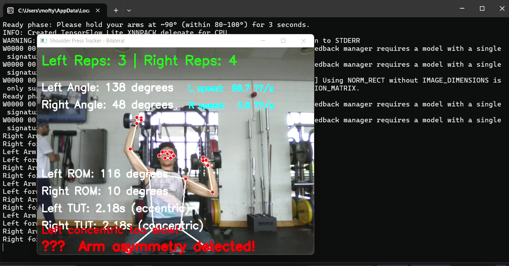

# Shoulder Press Pose Tracker (MediaPipe + OpenCV)

Real-time shoulder press form tracker built in Python using **MediaPipe Pose** and **OpenCV**.  
Tracks both arms live, counts reps, and logs session metrics to a CSV file.

---

## Features
- Live left/right elbow angle detection
- Rep counting per arm
- Tracks **ROM (range of motion)**, **TUT (time under tension)**, and **tempo (deg/sec)**
- Flags common form issues: **asymmetry**, **low ROM**, **incomplete lockout**, **tempo too fast/slow**
- Saves a session summary to: `data/shoulder_press_log.csv`

---

## Demo

> Screenshot:



---

## Tech Stack
- Python
- MediaPipe Pose
- OpenCV
- NumPy, Pandas

---

## Requirements
- Python **3.9+** recommended
- Webcam

---

## Setup & Run

1) Install dependencies:
```bash
pip install -r requirements.txt
